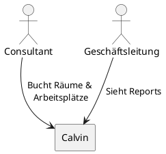
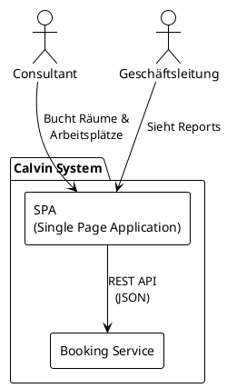

# Architekturdokumentation Calvin

---

## Einführung und Ziele

### Aufgabenstellung

Calvin ist INNOQs internes Raum- und Arbeitsplatzbuchungssystem zur Verwaltung von Ressourcen an 8 Bürostandorten (Monheim, Berlin, Hamburg, Köln, München, Zürich, Cham, Offenbach).

#### Treibende Kräfte

- INNOQ hat bisher kein dediziertes Buchungssystem
- Hybrides Arbeiten erfordert zuverlässige Arbeitsplatzkoordination
- Vermeidung von Ressourcenkonflikten und Doppelbuchungen

Für die vollständige Produktbeschreibung und Features siehe [Produktvision](../produkt/produktvision.md).

### Qualitätsziele

Die folgenden Qualitätsziele haben die höchste Priorität für die Architektur von Calvin. Die vollständigen Qualitätsszenarien sind in [Kapitel 10](#10-qualitätsanforderungen) dokumentiert.

| Priorität | Qualitätsziel | Szenario |
|-----------|---------------|----------|
| 1 | **Zuverlässigkeit** | Doppelbuchungen werden in 99,9% der Fälle serverseitig verhindert, auch bei gleichzeitigen Buchungsversuchen innerhalb derselben Sekunde. |
| 2 | **Performance** | Suchergebnisse für verfügbare Räume werden innerhalb von 500ms angezeigt, auch bei 150 gleichzeitigen Nutzern. |
| 3 | **Benutzbarkeit** | Neue Mitarbeiter können ohne Schulung ihre erste Buchung in maximal 5 Minuten abschließen. 90% schaffen dies ohne Hilfe. |
| 4 | **Verfügbarkeit** | 98% Verfügbarkeit während der Kernarbeitszeiten (8:00-18:00 Uhr). Bei Ausfall Wiederherstellung innerhalb von 30 Minuten. |

### Stakeholder

| Rolle | Erwartungshaltung |
|-------|-------------------|
| **INNOQ Mitarbeiter** | Einfache, schnelle Buchung von Räumen und Arbeitsplätzen. Übersicht wer im Büro sein wird. |
| **INNOQ Geschäftsführung** | Überblick über Büroauslastung als Basis für Standortstrategie (Büros verkleinern, schließen oder an anderen Standorten eröffnen). Hohe Mitarbeiterakzeptanz. |

---

## Kontextabgrenzung

### Überblick

Das Calvin-System ist INNOQs internes Raum- und Arbeitsplatzbuchungssystem. Das System operiert in einem minimalen Systemkontext.

### Fachlicher Kontext

---

## Bausteinsicht

### Ebene 1: Whitebox Gesamtsystem

Das Calvin-System besteht aus einer Single Page Application (SPA) und einem separaten Booking Service. Diese Architektur wurde für die Prototyping-Phase optimiert und ermöglicht eine klare Trennung zwischen Benutzeroberfläche und Geschäftslogik (siehe [ADR-002](adrs/adr-002-frontend-architektur.md) und [ADR-003](adrs/adr-003-backend-architektur.md)).

### Enthaltene Bausteine

| Baustein | Verantwortlichkeit | Quellcode |
|----------|-------------------|-----------|
| **SPA** | Benutzeroberfläche für Buchungen, Kalenderansichten und Reports | `frontend/` |
| **Booking Service** | Buchungslogik, Validierung, Konfliktprüfung, Auswertungsdaten | `backend/` |

### Schnittstelle: SPA → Booking Service

Die SPA kommuniziert mit dem Booking Service über eine REST API (JSON über HTTPS). Die API-Spezifikation wird als OpenAPI-Dokument im Backend gepflegt.

---

## Architekturentscheidungen

Architekturentscheidungen sind als Architecture Decision Records (ADR) dokumentiert. Die ADRs findest du unter `docs/arc42/adrs/`.

---

## Qualitätsanforderungen

Diese Qualitätsszenarien definieren die wesentlichen Qualitätsmerkmale des Calvin-Systems.

### Qualitätsbaum

1. **QS-2 (Doppelbuchungen)** - Kritisch, Kernfeature
2. **QS-1 (Performance)** - Hoch, direkter Einfluss auf Nutzererfahrung
3. **QS-5 (Benutzbarkeit)** - Hoch, essentiell für Akzeptanz
4. **QS-3 (Verfügbarkeit)** - Mittel, Ausfälle sind kompensierbar
5. **QS-4 (Erweiterbarkeit)** - Mittel, ausreichend Vorlaufzeit

### Qualitätsszenarien

#### QS-1: Performance bei Raumsuche

**Qualitätsmerkmal**: Performance / Antwortzeit

**Szenario**:
Während der normalen Arbeitszeit sucht ein INNOQ-Mitarbeiter im Calvin-System nach verfügbaren Räumen an einem bestimmten Standort für einen ausgewählten Zeitraum. Die Suchergebnisliste mit allen verfügbaren Räumen wird innerhalb von 500ms angezeigt, auch bei gleichzeitiger Nutzung durch bis zu 150 Mitarbeiter.

**Motivation**:
Die schnelle Anzeige von Suchergebnissen ist essentiell für die in der Vision versprochene "unkomplizierte unbürokratische leichte Buchung". Mitarbeiter wie Alex Berger, die nur einen Tag pro Woche im Büro sind, müssen ihre Buchungen schnell und effizient durchführen können.

---

#### QS-2: Verhinderung von Doppelbuchungen

**Qualitätsmerkmal**: Zuverlässigkeit / Datenintegrität

**Szenario**:
In einer normalen Betriebssituation versuchen zwei INNOQ-Mitarbeiter gleichzeitig (innerhalb derselben Sekunde) denselben Raum für denselben Zeitraum zu buchen. Das System verarbeitet die erste vollständige Buchungsanfrage erfolgreich und lehnt die zweite Anfrage mit einer verständlichen Fehlermeldung ab. Doppelbuchungen werden in 99,9% der Fälle serverseitig verhindert.

**Motivation**:
Die Verhinderung von Doppelbuchungen ist ein Kernfeature von Calvin und essentiell für das Nutzervertrauen. Das System muss die "Sicherheit einen Arbeitsplatz, oder Meetingraum wirklich verfügbar zu haben" garantieren.

---

#### QS-3: Verfügbarkeit während Arbeitszeiten

**Qualitätsmerkmal**: Verfügbarkeit

**Szenario**:
Während der typischen INNOQ-Arbeitszeiten (8:00-18:00 Uhr an Werktagen) ist das Calvin-System verfügbar und funktionsfähig. Das System erreicht eine Verfügbarkeit von 98% während dieser Kernarbeitszeiten. Bei einem Ausfall ist das System innerhalb von 30 Minuten wieder betriebsbereit.

**Motivation**:
Obwohl Ausfälle durch alternative Kommunikationswege (z.B. interner Messenger) kompensiert werden können, sollte Calvin während der Arbeitszeiten verlässlich verfügbar sein, um den Buchungsprozess nicht zu behindern.

---

#### QS-4: Erweiterbarkeit um neue Standorte

**Qualitätsmerkmal**: Änderbarkeit / Erweiterbarkeit

**Szenario**:
Bei geplanter INNOQ-Expansion fügt ein Entwickler einen neuen Standort mit allen zugehörigen Räumen und Arbeitsplätzen zum Calvin-System hinzu. Die Implementierung, das Testing und das Deployment der Änderung sind innerhalb eines Release-Zyklus (2 Wochen) abgeschlossen, ohne bestehende Funktionalität zu beeinträchtigen.

**Motivation**:
INNOQ betreibt aktuell 8 Standorte und könnte in Zukunft expandieren. Die Multi-Standort-Architektur muss flexibel genug sein, um neue Standorte mit vertretbarem Aufwand zu integrieren.

---

#### QS-5: Intuitive Bedienbarkeit für neue Mitarbeiter

**Qualitätsmerkmal**: Benutzbarkeit / Erlernbarkeit

**Szenario**:
Ein neuer INNOQ-Mitarbeiter ohne vorherige Schulung nutzt Calvin zum ersten Mal, um einen Arbeitsplatz für den nächsten Tag zu buchen. Der Mitarbeiter findet intuitiv den richtigen Weg durch die Oberfläche und schließt die Buchung erfolgreich in maximal 5 Minuten und maximal 20 Klicks ab. 90% der neuen Mitarbeiter schaffen ihre erste Buchung ohne Hilfe.

**Motivation**:
Die Vision betont "unkomplizierte unbürokratische leichte Buchung für jeden". Das System muss selbsterklärend sein, auch wenn im Zweifel Kollegen helfen können. Eine niedrige Einstiegshürde fördert die angestrebte 90%ige Mitarbeiterakzeptanz.

---

## Risiken und technische Schulden

Dieses Dokument listet bewusst eingegangene technische Schulden der Prototyping-Phase. Diese Vereinfachungen ermöglichen schnelle Entwicklung, müssen aber vor Produktivbetrieb adressiert werden.

| Schuld | Aktuell | Warum okay für Prototyp | Vor Produktion |
|--------|---------|-------------------------|----------------|
| **Basic Auth statt Okta** | Simple Basic Auth ohne echte Passwort-Validierung. Der Username identifiziert den Nutzer, das Passwort wird nicht geprüft. | Ermöglicht einfaches Testen verschiedener Nutzer ohne Okta-Setup. Keine echten Nutzerdaten im Spiel. | Integration mit INNOQ Okta für echte Authentifizierung. |
| **Mock-Daten im Frontend** | Ressourcendaten (Räume, Arbeitsplätze) liegen als statische Daten im Frontend. Keine Persistenz im Backend. | Schnellere Frontend-Entwicklung ohne Backend-Abhängigkeit. Ressourcendaten ändern sich selten. | Ressourcen-Management ins Backend verlagern mit persistenter Datenhaltung. |

---

## Glossar

Das Glossar findest du unter [/docs/produkt/glossar.md](/docs/produkt/glossar.md).
