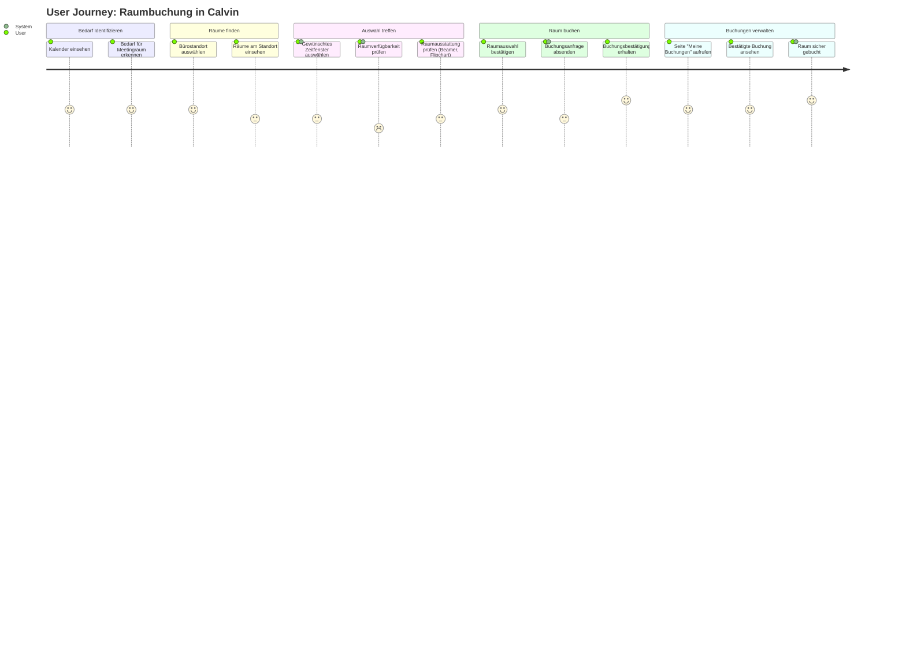

# User Journey: Einen Raum buchen

## Übersicht
Dieses Dokument beschreibt die User Journey für die Buchung eines Raumes mit dem Calvin Raumbuchungssystem, von der initialen Bedarfsidentifikation bis zur erfolgreichen Buchungsbestätigung.

## User Journey Ablauf

